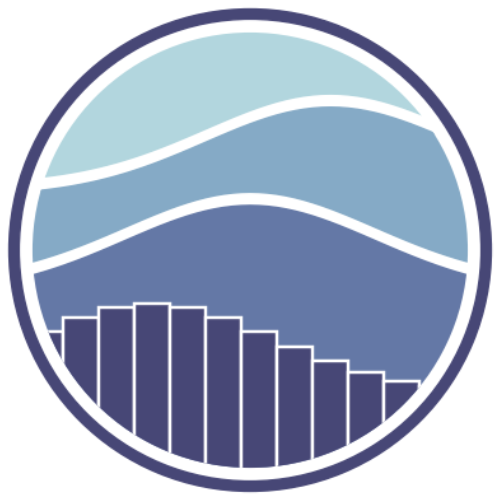

<h1 align="right"><a href="https://komarev.com/ghpvc/?username=vvidhig"></a></h1>

<h1 align="center">
    
</h1>

<div>
     
- pursuing a bachelor's degree in computer science (2026 batch)

- lives in Kolkata, India (from Gorakhpur)
  
- working as a junior data scientist at Omdena

- learning gen ai and mlops right now

- a bookworm and a weeb

</p>

<p>  
  <a href="https://www.linkedin.com/in/vvidhig310105/">
    
  </a>&nbsp;&nbsp;
  <a href="https://mail.google.com/mail/u/?authuser=vidhidoesnotreply@gmail.com">
            
  </a>&nbsp;&nbsp;
  
</p>


```
 only I get to call my dreams stupid - roronoa zoro
```

</div>

<h3 align="center"></h3>
<div align="center">
    
# Tech Stack





</div>

<div align="center"><br/>
<h3 align="center"></h3>

# Statistics

<table align="center">  
    <tr><td align="center">
    <a href="/"></a>
</td>
    <td align="center">
        <a href="/"></a>
    </td></tr>
    <tr><td align="center">


</td>
<td align="center">


</td></tr>
    <tr>
        <td align="center" colspan="2">
            <p align="center">
              <a href="https://github.com/vvidhig">
      </a>
</p></td> </tr>
</table>
</div>
<h3 align="center"></h3>

<div align="center">

# Projects

<table align="center" cellspacing="3">
<tr><td>
<a href="https://github.com/vvidhig/Loan-Prediction-Model-Package"></a>
</td><td>
<a href="https://github.com/vvidhig/Malarial-Cell-Detection-Model"></a>
</td></tr><tr><td>
<a href="https://github.com/vvidhig/Human-Activity-Recognition-using-Smartphone-Data"></a>
</td><td>
<a href="https://github.com/vvidhig/Solar-Irradiance-Prediction-Model"></a>
</td></tr>
<tr>
    <td align="center" colspan="2"><h3 align="center"> consider giving some of the repos a &nbsp;🌟 &nbsp;!</h3></td>
</tr></table>
</div>

<h3 align="center"></h3>


